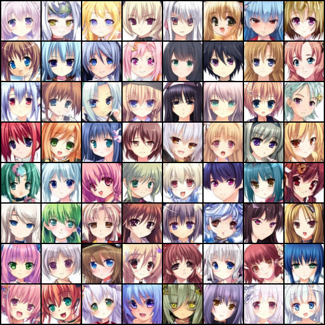

# VisGen: Fast & Simple Vision Generative Models

**VisGen** is an accessible and educational project designed for users who want to quickly learn and experiment with classic vision generative models. With a minimalist yet production-quality PyTorch implementation, this project allows you to understand the fundamentals behind popular generative approaches while running experiments with ease.

<div style="text-align: center;">
  
  <figcaption>Samples from DDPM trained from scratch</figcaption>
</div>

## Overview

VisGen provides straightforward implementations of key generative models, including Autoencoder, VAE, VQ-VAE, GAN, and diffusion-based models like DDPM and FlowMatch. Each model is crafted to emphasize the core algorithmic concepts without unnecessary complexity—making it ideal for researchers, developers, or students eager to learn from hands-on coding experiments.

## 🛠️ Setup

Start by cloning the repository and setting up the environment. The project uses Python 3.11 and relies on PyTorch and associated libraries.

1. **Clone the repository** (requires git):
   ```bash
   git clone https://github.com/xxxxxxxxxxxxxxxxx
   cd VisGen
   ```

2. **Install dependencies** (requires conda):
   ```bash
   conda create -n visgen python=3.11.11 -y
   conda activate visgen
   pip install -r requirements.txt
   ```

## 🚀 Usage

### Dataset Preparation

For instance, to work with the widely-used [Anime Face dataset](https://www.kaggle.com/datasets/splcher/animefacedataset) (63,565 images), download and unzip the data, then organize your images using:

```bash
python make_dataset.py /path/to/source_folder /path/to/target_folder
```

### Training Models

Set the appropriate project path and train your chosen model. For example, to train a particular model variant:

```bash
export PYTHONPATH=/path/to/your/project:$PYTHONPATH
python examples/train_vae.py  # Example for training VAE
```

Other model scripts include `train_autoencoder.py`, `train_gan.py`, `train_ddpm.py`, etc. Each script corresponds to a specific model variant.

## 📊 Experiments

Experiments have been conducted on a single NVIDIA A800-PCIe-80GB GPU under fixed settings (batch size: 128, resolution: 64×64). Please note that these modules use **ResNet-based** blocks by **default**; if your GPU memory is not enough, we also provide a **Basic** block alternative.

<div style="text-align: center; width: 100%; overflow-x: auto;">
    <table style="width: 100%; border-collapse: collapse; margin: 0 auto;">
        <thead>
            <tr>
                <th style="text-align: center;">Model</th>
                <th style="text-align: center;">Training Time</th>
                <th style="text-align: center;">Memory Usage</th>
            </tr>
        </thead>
        <tbody>
            <tr>
                <td>Autoencoder</td>
                <td>15 minutes</td>
                <td>4 GB</td>
            </tr>
            <tr>
                <td>VAE</td>
                <td>15 minutes</td>
                <td>4 GB</td>
            </tr>
            <tr>
                <td>VQ-VAE</td>
                <td>15 minutes</td>
                <td>4 GB</td>
            </tr>
            <tr>
                <td>WGAN-GP</td>
                <td>3 hours</td>
                <td>10 GB</td>
            </tr>
            <tr>
                <td>StyleGAN2</td>
                <td>4 hours</td>
                <td>15 GB</td>
            </tr>
            <tr>
                <td>DDPM</td>
                <td>1 hour</td>
                <td>7 GB</td>
            </tr>
            <tr>
                <td>DDPM (4× Default Channels)</td>
                <td>4.6 hours</td>
                <td>25 GB</td>
            </tr>
            <tr>
                <td>FlowMatch</td>
                <td>1 hour</td>
                <td>7 GB</td>
            </tr>
        </tbody>
    </table>
</div>
