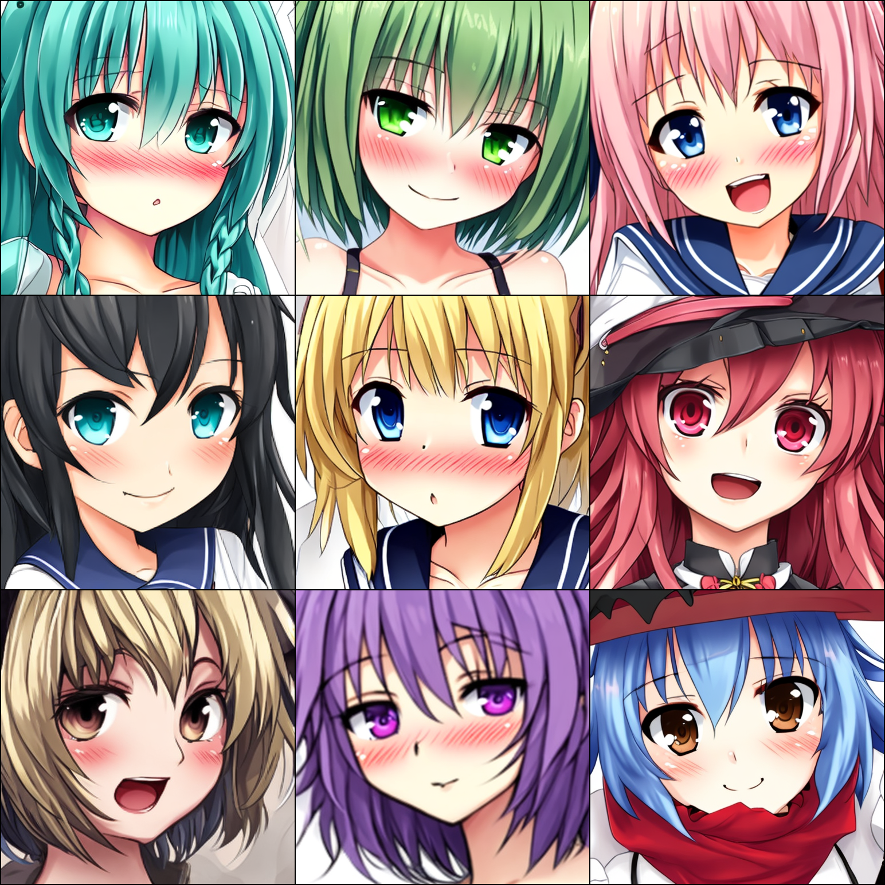

# VisGen: Fast & Simple Vision Generative Models

**VisGen** is an accessible and educational project designed for users who want to quickly learn and experiment with classic vision generative models. With a minimalist yet production-quality PyTorch implementation, this project allows you to understand the fundamentals behind popular generative approaches while running experiments with ease.


## Overview

VisGen provides straightforward implementations of key generative models, including Autoencoder, VAE, VQ-VAE, GAN, and diffusion-based models like DDPM and FlowMatch. Each model is crafted to emphasize the core algorithmic concepts without unnecessary complexity—making it ideal for researchers, developers, or students eager to learn from hands-on coding experiments.

## 🛠️ Setup

Start by cloning the repository and setting up the environment. The project uses Python 3.11 and relies on PyTorch and associated libraries.

1. **Clone the repository** (requires git):
   ```bash
   git clone https://github.com/Pearisli/VisGen.git
   cd VisGen-main
   ```

2. **Install dependencies** (requires conda):
   ```bash
   conda create -n visgen python=3.11.11 -y
   conda activate visgen
   pip install -r requirements.txt
   ```

## 🎮 Basic Usage

### 1. Prepare Dataset

Download and extract your dataset, for example the [Anime Face dataset (63K images)](https://www.kaggle.com/datasets/splcher/animefacedataset).

### 2. Train a Model

Set the project path and launch training. Example for VAE:

```bash
export PYTHONPATH=/path/to/your/project:$PYTHONPATH
python examples/train_vae.py
```

Other model scripts include `train_autoencoder.py`, `train_gan.py`, `train_ddpm.py`, etc. Each script corresponds to a specific model variant.

## 📊 Experiments

Experiments have been conducted on a single NVIDIA A800-PCIe-80GB GPU under fixed settings (batch size: 128, resolution: 64×64). Please note that these modules use **ResNet-based** blocks by **default**; if your GPU memory is not enough, we also provide a **Basic** block alternative or reduce the channels and batch size.

<div style="text-align: center; width: 100%; overflow-x: auto;">
    <table style="width: 100%; border-collapse: collapse; margin: 0 auto;">
        <thead>
            <tr>
                <th style="text-align: center;">Model</th>
                <th style="text-align: center;">Training Time</th>
                <th style="text-align: center;">Memory Usage</th>
            </tr>
        </thead>
        <tbody>
            <tr>
                <td>Autoencoder</td>
                <td>15 minutes</td>
                <td>4 GB</td>
            </tr>
            <tr>
                <td>VAE</td>
                <td>15 minutes</td>
                <td>4 GB</td>
            </tr>
            <tr>
                <td>VQ-VAE</td>
                <td>15 minutes</td>
                <td>4 GB</td>
            </tr>
            <tr>
                <td>WGAN-GP</td>
                <td>3 hours</td>
                <td>10 GB</td>
            </tr>
            <tr>
                <td>StyleGAN2</td>
                <td>4 hours</td>
                <td>15 GB</td>
            </tr>
            <tr>
                <td>DDPM</td>
                <td>4.6 hours</td>
                <td>25 GB</td>
            </tr>
            <tr>
                <td>FlowMatch</td>
                <td>4.6 hours</td>
                <td>25 GB</td>
            </tr>
        </tbody>
    </table>
</div>

## 🚀 Advanced Training

In this section, we will dive deeper into training a **Latent Diffusion Model (LDM)** on larger, high-resolution datasets and explore text-conditioned generation to broaden the model's applications. Each step includes not only commands and parameter settings but also pedagogical notes to help you understand the underlying principles and best practices.

### 1. Install Extended Dependencies

Training LDMs requires additional libraries for high-performance data loading, multi-process management, and advanced optimization:
```bash
pip install -r requirements+.txt
```

### 2. Prepare Dataset and Captions

- **Dataset**: Use the [Anime Faces 512×512 (140K images)](https://www.kaggle.com/datasets/lukexng/animefaces-512x512) to train on high-resolution images for finer details.
- **Captions**: Generate textual tags using the pretrained [DeepDanbooru-PyTorch](https://huggingface.co/pearisli/deepdanbooru-pytorch) model to provide rich text conditions.
- **Custom Dataset Structure**: For more flexible folder layouts, refer to the [Hugging Face Datasets ImageFolder guide](https://huggingface.co/docs/datasets/image_load#imagefolder).

### 3. Launch Training with `accelerate`

The `accelerate` library simplifies multi-GPU, mixed-precision, and distributed setups:
```bash
accelerate launch \
    --num_machines=1 \
    --mixed_precision='no' \
    --num_processes=1 \
    --dynamo_backend='no' \
    examples/train_ldm.py \
    --config ./config/train_ldm.yaml
```
- `--mixed_precision=no`: Default to full precision (FP32) to support all GPUs.
- **Enable `bf16`** on supported hardware (e.g., NVIDIA A100/A800, H100, or Google Cloud TPUs v4) by setting `--mixed_precision=bf16`.

### 4. Sampling Results

After training, generate samples with 200 DDIM steps:

#### Unconditional Generation
  


#### Text-Conditioned Generation
---
**From Scratch**


--- 
**LoRA Fine-Tuning**

